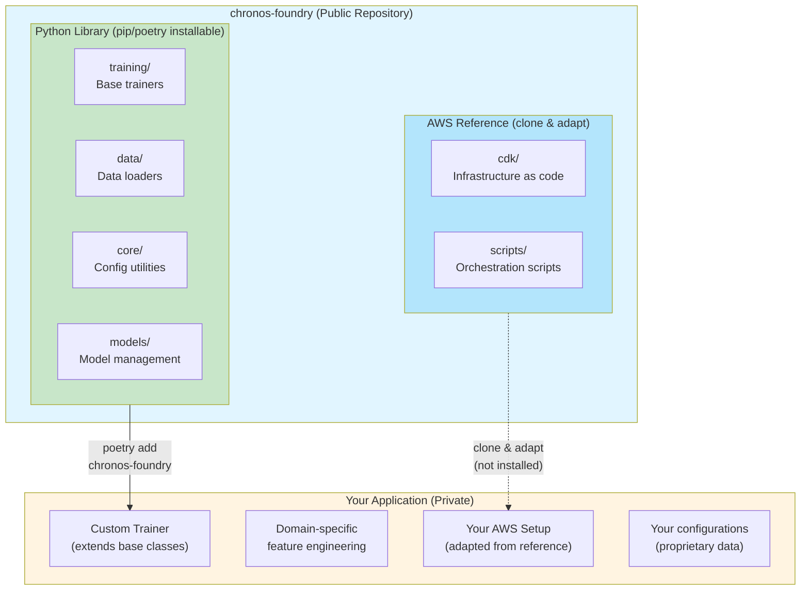

# Chronos Foundry

Chronos forecasting framework with covariate integration, incremental training with automatic rollback, checkpoint-based resumable training for large date ranges, and cost-optimized AWS orchestration ($0 idle cost). Built for proprietary time series data with configuration-driven architecture and state-managed concurrent run prevention.

## Overview

Chronos Trainer is a reusable library extracted from a production time series forecasting system. It provides:

- **Python Library**: Installable via `poetry` for core functionality
- **AWS Reference**: Clone-and-adapt infrastructure for cost-optimized cloud training
- **Extensible Architecture**: Base classes you inherit and customize for your domain

### Architecture



### Key Concepts

**What gets installed (`poetry add chronos-foundry`):**
- ✅ Python library code (training, data, core, models)
- ✅ Importable base classes and utilities
- ❌ NOT the AWS infrastructure

**What you clone and adapt:**
- AWS CDK infrastructure templates
- Bash orchestration scripts
- S3 state management patterns
- You customize for your buckets, data, credentials

**Your implementation:**
- Extend base classes (e.g., `CovariateTrainer`)
- Implement domain-specific feature engineering
- Adapt AWS reference to your infrastructure
- Keep your data and configs private

## Features

### Core Library Features

- **Extensible Base Classes**: Inherit `CovariateTrainer`, `IncrementalTrainer` for your domain
- **Covariate Integration**: Built-in support for external variables (economic indicators, weather, market data, etc.)
- **Incremental Training**: Continuous model improvement with quality gates and automatic rollback
- **Model Versioning**: Complete lifecycle management with metadata tracking
- **Checkpoint System**: Resumable training for large date ranges with state persistence
- **Configuration-Driven**: No hardcoded values - everything via YAML/environment variables

### AWS Reference Implementation

- **$0 Idle Cost**: Ephemeral EC2 instances, auto-termination
- **State Management**: S3-based state files for concurrent run prevention
- **CDK Infrastructure**: VPC, Security Groups, IAM roles, S3 gateway endpoint
- **Bash Orchestration**: `launch_training.sh`, `monitor_training.sh`, `kill_training.sh`
- **Automatic Cleanup**: Resources terminate after training completes

### Production Patterns

- **Idempotency**: All operations are re-runnable without side effects
- **Type Annotations**: Full type hints throughout codebase
- **Pydantic Validation**: Structured I/O with fail-fast error handling
- **Audit Logging**: Complete trace of all processing activities
- **Error Handling**: Comprehensive error classification and recovery

## Installation

### Using Poetry (Recommended)

```bash
# From PyPI (when published)
poetry add chronos-foundry

# From source (development)
git clone https://github.com/yourusername/chronos-foundry.git
cd chronos-foundry
poetry install

# For development with all tools
poetry install --with dev
```

### Using pip (Alternative)

```bash
# From PyPI (when published)
pip install chronos-foundry
```

## Quick Start

### As a Library

```python
from chronos_trainer import CovariateTrainer, ConfigProvider
import pandas as pd

# Load configuration
config = ConfigProvider.load_config("config.yaml")

# Create custom trainer for your domain
class MyDomainTrainer(CovariateTrainer):
    def _engineer_features(self, df: pd.DataFrame) -> pd.DataFrame:
        """Implement your domain-specific feature engineering"""

        # Example: Add rolling statistics
        df['rolling_mean_24h'] = df['value'].rolling(24).mean()
        df['rolling_std_24h'] = df['value'].rolling(24).std()

        # Example: Time-based features
        df['hour'] = df['timestamp'].dt.hour
        df['day_of_week'] = df['timestamp'].dt.dayofweek

        # Your domain-specific logic here
        return df

# Train
trainer = MyDomainTrainer(config)
trainer.train(data)
trainer.save_model("./models/my_model")
```

### Configuration Template

Create a `config.yaml` for your domain:

```yaml
# Data paths
data:
  root_dir: "/path/to/your/data"
  output_dir: "./data/output"

# Define your schema
schema:
  datetime_column: "timestamp"
  target_columns:
    - "your_target_value"
  covariate_columns:
    external_factors: []  # Weather, economic indicators, etc.
    domain_features: []   # Your custom features

# Model configuration
model:
  name: "chronos-bolt-base"
  prediction_length: 64
  context_length: 512

# Training settings
training:
  preset: "high_quality"
  incremental:
    enabled: true
    performance_threshold: 0.05
    rollback_enabled: true

# Covariate integration
covariates:
  enabled: true
  regressors:
    - catboost
    - xgboost
    - lightgbm
```

### AWS Deployment (Reference Implementation)

The AWS infrastructure is provided as a **reference implementation**. Clone the repo and adapt to your needs:

```bash
# 1. Clone repository for full setup
git clone https://github.com/yourusername/chronos-foundry.git
cd chronos-foundry

# 2. Install the Python library
poetry install

# 3. Configure AWS for your account
cp .env.template .env
# Edit .env with your AWS profile, S3 bucket, region, etc.

# 4. Deploy infrastructure (one-time)
cd aws/cdk
cdk deploy

# 5. Launch training on EC2
cd ../scripts
./launch_training.sh

# 6. Monitor progress (in another terminal)
./monitor_training.sh

# 7. Emergency stop (if needed)
./kill_training.sh
```

**Important:** AWS components are **NOT** installed via `poetry add` or `pip install`. They're deployment tools you clone and customize for your:
- S3 buckets and data paths
- EC2 instance types and AMIs
- IAM roles and security groups
- Environment-specific configurations

## Project Structure

```
chronos-foundry/
├── src/chronos_trainer/           # Python library (installable)
│   ├── training/                   # Base trainer classes
│   │   ├── base_trainer.py         # Core trainer logic
│   │   ├── covariate_trainer.py    # Covariate integration
│   │   ├── incremental_trainer.py  # Versioning & rollback
│   │   └── checkpoint_manager.py   # Resumable training
│   ├── data/                       # Data loading
│   │   ├── resumable_loader.py     # Checkpoint-based loading
│   │   └── data_buffer.py          # Efficient data handling
│   ├── core/                       # Configuration & utilities
│   │   ├── config_provider.py      # YAML config loading
│   │   └── logging_manager.py      # Structured logging
│   └── models/                     # Model management
│       └── model_versioning.py     # Lifecycle management
│
├── aws/                            # Reference implementation (NOT in package)
│   ├── cdk/                        # Infrastructure as code
│   │   ├── lib/                    # CDK stack definitions
│   │   └── bin/                    # CDK app entry point
│   └── scripts/                    # Orchestration scripts
│       ├── launch_training.sh      # Launch EC2 training
│       ├── monitor_training.sh     # Monitor via S3 state
│       ├── kill_training.sh        # Emergency termination
│       ├── bootstrap.sh            # EC2 initialization
│       └── cleanup.sh              # Resource cleanup
│
├── docs/                           # Documentation
│   ├── aws/                        # AWS architecture docs
│   ├── aws-setup/                  # Setup guides
│   └── USAGE.md                    # Detailed usage guide
│
└── examples/                       # Example implementations
```

## Usage Patterns

### 1. Library-Only Usage

If you already have infrastructure, just use the Python library:

```bash
poetry add chronos-foundry
```

Then extend the base classes for your domain.

### 2. Full Stack (Library + AWS)

For complete cloud training setup:

1. Install library: `poetry add chronos-foundry`
2. Clone repo for AWS reference
3. Adapt AWS to your infrastructure
4. Deploy and train

### 3. Hybrid Approach

- Use library for local development/testing
- Adapt AWS reference for production training
- Keep data and configs private

## Example Use Cases

### Financial Time Series
- **Target**: Asset prices, trading volumes
- **Covariates**: Economic indicators, sentiment scores, market indices
- **Features**: Returns, volatility, correlations, technical indicators

### Retail Demand Forecasting
- **Target**: Units sold, revenue
- **Covariates**: Promotions, holidays, weather, competitor activity
- **Features**: Seasonality, trends, event impacts

### Energy Load Prediction
- **Target**: Electricity demand (MW)
- **Covariates**: Temperature, humidity, time-of-day, holidays
- **Features**: Historical patterns, weather correlations, peak detection

### IoT Sensor Data
- **Target**: Sensor readings, anomaly detection
- **Covariates**: Environmental factors, operational parameters
- **Features**: Rolling statistics, change detection, pattern recognition

## Key Design Principles

### 1. Configuration-Driven
- No hardcoded paths or credentials
- All behavior controlled via YAML configuration
- Environment variables for deployment-specific settings

### 2. Idempotency First
- All operations re-runnable without manual cleanup
- State tracking prevents duplicate processing
- Checksums and timestamps for data integrity

### 3. Type Safety
- Pydantic models for structured I/O
- Explicit type annotations throughout
- Fail-fast validation with clear error messages

### 4. Temporal Data Organization
- YYYY/MM directory structure for time series data
- Enables incremental loading and processing
- Supports checkpoint-based resumption

### 5. Production Ready
- Comprehensive error handling
- Structured logging with audit trails
- State management for concurrent run prevention
- Automatic resource cleanup

## AWS Infrastructure Details

### Cost Optimization
- **$0 Idle Cost**: No always-on resources
- **Ephemeral Instances**: Launch only when training
- **S3 Gateway Endpoint**: Zero data transfer costs for S3 access
- **Public Subnet**: No NAT Gateway charges
- **Auto-Termination**: Instance stops after training completes

### State Management
- S3-based state files for coordination
- Atomic writes prevent race conditions
- Concurrent run prevention
- Progress tracking via JSON artifacts

### Security
- IAM roles (no hardcoded credentials)
- Egress-only security groups (HTTPS only)
- S3 encryption at rest
- Environment-based access control

## Documentation

- [Documentation Index](docs/README.md) - All documentation organized by topic
- [Getting Started](docs/getting-started/README.md) - Installation and quick examples
- [Usage Guide](docs/user-guides/usage-guide.md) - Complete implementation guide
- [AWS Quickstart](docs/getting-started/aws-quickstart.md) - Deploy on AWS in 5 steps
- [AWS Documentation](docs/aws/index.md) - AWS architecture and reference
- [Architecture](docs/architecture/README.md) - System design and implementation

## Development

### Running Tests

```bash
poetry run pytest tests/ -v
```

### Code Quality

```bash
# Format code
poetry run black src/

# Type checking
poetry run mypy src/

# Linting
poetry run flake8 src/
```

### Security Checks

```bash
# Scan for secrets
poetry run detect-secrets scan --all-files

# Run all pre-commit hooks
poetry run pre-commit run --all-files
```

## Contributing

Contributions welcome! Please read [CONTRIBUTING.md](CONTRIBUTING.md) for:
- Code conventions (snake_case, type hints, pydantic)
- Pull request process
- Security guidelines
- Testing requirements

## License

MIT License - see [LICENSE](LICENSE) for details

## Acknowledgments

Built on:
- **Amazon Chronos Models** - Foundation time series models
- **AutoGluon** - ML framework for training and inference
- **AWS CDK** - Infrastructure as code

## Support

- **Issues**: [GitHub Issues](https://github.com/yourusername/chronos-foundry/issues)
- **Documentation**: [docs/](docs/)
- **Examples**: [examples/](examples/)

---

**Note**: This is a framework library. You bring your own:
- Time series data
- Domain-specific feature engineering
- AWS infrastructure (adapt the reference)
- Configuration for your use case

The library provides the foundation; you implement the domain specifics.
