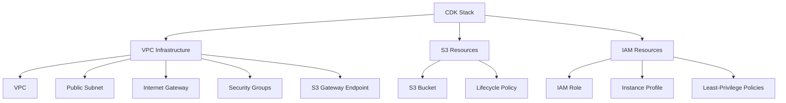

# CDK Implementation Guide for EC2 Training Orchestration

## Overview

This CDK stack provisions persistent AWS infrastructure that costs $0/month when idle. The stack creates only long-lived network and identity resources: a VPC with public subnet, S3 Gateway Endpoint, S3 bucket, IAM roles, and security groups. Ephemeral compute resources (EC2 instances, EBS volumes) are created by runtime scripts, not CDK, allowing zero-cost periods between training runs.

The architecture deliberately excludes NAT Gateway, CloudWatch dashboards, and persistent compute to maintain zero idle cost. All training orchestration, state management, and cleanup logic executes outside CDK through launch scripts documented in [Training Orchestration](training-orchestration.md).

## Design Philosophy

### Naming and Scope

Infrastructure resources use consistent naming conventions to ensure resource discoverability across AWS accounts, Git repositories, and documentation. The "Chronos" term refers to the forecasting model being trained by this infrastructure platform.

### Configuration Architecture

Environment-specific values (dev, stage, prod) and operational metadata (cost center) flow through CDK context rather than being hardcoded in stack definitions. This design enables deploying multiple isolated environments from a single codebase without modification. Context parameters can be overridden at deployment time via command line (`cdk deploy -c environment=stage`) or persisted in `cdk.json` for default behavior. When the system eventually requires separate AWS accounts for production isolation, the same stack code deploys without changes—only context values differ.

Account ID and region are similarly centralized in CDK context to support future multi-account strategies. This centralization means deployment commands reference the same source files regardless of target account, reducing the risk of configuration drift between environments.

### Resource Tagging

Four mandatory tags apply to every resource in the stack: `Project`, `Environment`, `CostCenter`, and `ManagedBy`. The tagging strategy serves three primary functions: IAM policy enforcement, cost allocation, and lifecycle management.

The `Project=Chronos-Training` tag enables IAM conditions that restrict EC2 self-termination to instances belonging to this project only. This prevents training instances from accidentally terminating unrelated resources while still allowing automated cleanup. Cost Explorer uses this tag for high-level project cost grouping, and resource lifecycle automation can safely target all resources with this tag when decommissioning the platform.

The `Environment` tag supports traditional software development lifecycle progression (dev→stage→prod) rather than evolutionary "phase" nomenclature. This choice reflects the system's path toward production-grade operation where environments may coexist in separate AWS accounts. Cost tracking per environment answers questions like "How much does dev experimentation cost compared to production?" and supports blue/green deployment patterns when needed.

The `CostCenter` tag represents workload type (collect, train, serve) rather than environment or organizational structure. This workload-based attribution enables answering business questions such as "Is model training or inference serving more expensive?" Finance teams can allocate budgets to functional areas—data pipeline infrastructure, compute-intensive training, or API serving—independent of which environment runs the workload. As the platform scales, this granularity reveals optimization opportunities within specific workload types.

The `ManagedBy=CDK` tag distinguishes infrastructure-as-code managed resources from manually created ones. This separation enables safe automation ("delete all CDK-managed resources") while protecting hand-crafted resources from accidental deletion. It also documents deployment provenance for audit and troubleshooting purposes.

Tags for `Owner`, `Team`, `CreatedBy`, or `Application` were deliberately excluded. The single-user, single-project nature of this MVP makes ownership tracking unnecessary. Additional tags add cognitive overhead during development and AWS Console navigation. The four chosen tags provide 80% of operational value with minimal complexity, and new tags can be added later as multi-user requirements emerge without breaking existing infrastructure.

### MVP Boundaries

The CDK stack creates VPC infrastructure, S3 storage, IAM roles, and security groups—all zero-cost when idle. It explicitly excludes EC2 instances, NAT Gateway, CloudWatch resources, and state management logic. Runtime orchestration, training execution, and cleanup are handled by external scripts that create ephemeral resources on demand. This separation ensures the stack remains lightweight and that billing only occurs during active training runs.

## Architecture Overview



The stack creates a VPC with single public subnet in one availability zone, sufficient for single-user training workloads. An Internet Gateway provides outbound connectivity for package installation (pip, apt, git). An S3 Gateway Endpoint routes all S3 traffic through AWS's internal network at zero data transfer cost, eliminating the largest egress expense.

S3 bucket naming incorporates environment (`chronos-training-dev-{account}-{region}`) to support deploying multiple environments in the same account. Lifecycle rules automatically transition logs and artifacts to cheaper storage tiers and delete them after retention periods expire (14 days for logs, 60 days for artifacts).

IAM roles grant training instances read access to cached datasets and write access to environment-scoped output prefixes. Instances can describe and terminate EC2 instances, but only those tagged with `Project=Chronos-Training`, preventing cross-project interference. Security groups allow only HTTPS egress (port 443) for S3 API calls and package downloads.

## Infrastructure Components

### VPC and Networking

The network architecture uses a public subnet with ephemeral public IPs rather than a private subnet with NAT Gateway. This design choice trades minor security hardening for significant operational simplicity and zero idle cost. NAT Gateway would cost $32/month continuously plus $0.045/GB processed. For ephemeral 2-4 hour training runs with no inbound services, public IPs pose minimal risk while eliminating network infrastructure management.

```typescript
private createVPC(): ec2.Vpc {
  const vpc = new ec2.Vpc(this, 'ChronosTrainingVPC', {
    maxAzs: 1,
    natGateways: 0,
    subnetConfiguration: [
      {
        cidrMask: 24,
        name: 'Public',
        subnetType: ec2.SubnetType.PUBLIC,
        mapPublicIpOnLaunch: true
      }
    ],
    enableDnsHostnames: true,
    enableDnsSupport: true,
  });

  vpc.addGatewayEndpoint('S3Endpoint', {
    service: ec2.GatewayVpcEndpointAwsService.S3,
  });

  return vpc;
}
```

The S3 Gateway Endpoint handles 10GB+ of training data transfer per run at zero cost. Only the ~500MB of package installation traffic (~$0.04/run) exits through the Internet Gateway. Security groups prevent all inbound connections, and instances exist for at most 4 hours before self-terminating. Organizations requiring "no public IPs" for compliance can adopt the NAT Gateway approach documented in Phase 2 enhancements.

### S3 Storage

Bucket names incorporate environment to support isolated dev/stage/prod deployments. Lifecycle rules apply separately to logs and artifacts, balancing retention needs with storage costs.

```typescript
private createS3Bucket(): s3.Bucket {
  const environment = this.node.tryGetContext('environment') || 'dev';
  const bucket = new s3.Bucket(this, 'ChronosTrainingBucket', {
    bucketName: `chronos-training-${environment}-${this.account}-${this.region}`,
    versioned: false,
    encryption: s3.BucketEncryption.S3_MANAGED,
    blockPublicAccess: s3.BlockPublicAccess.BLOCK_ALL,
    enforceSSL: true,
    lifecycleRules: [
      {
        id: 'TrainingLogs',
        enabled: true,
        prefix: `${environment}/logs/`,
        expiration: cdk.Duration.days(14)
      },
      {
        id: 'ModelArtifacts',
        enabled: true,
        prefix: `${environment}/`,
        expiration: cdk.Duration.days(90),
        transitions: [
          {
            storageClass: s3.StorageClass.INFREQUENT_ACCESS,
            transitionAfter: cdk.Duration.days(30)
          }
        ]
      }
    ]
  });

  return bucket;
}
```

Training logs under `{environment}/logs/` delete after 14 days since they serve only immediate debugging purposes. Model artifacts transition to Infrequent Access storage at 30 days and delete at 90 days, balancing accessibility with cost. Server-side encryption (SSE-S3) protects data at rest, and bucket policies enforce HTTPS for all access.

### IAM Roles and Policies

Training instances assume a role with three inline policies: read-only S3 access to cached datasets, read-write access to environment-scoped output prefixes, and conditional EC2 termination permission.

```typescript
private createIAMRole(): iam.Role {
  const environment = this.node.tryGetContext('environment') || 'dev';
  const trainingRole = new iam.Role(this, 'ChronosTrainingRole', {
    assumedBy: new iam.ServicePrincipal('ec2.amazonaws.com'),
    description: `IAM role for Chronos Training instances (${environment})`,
    inlinePolicies: {
      S3ReadAccess: new iam.PolicyDocument({
        statements: [
          new iam.PolicyStatement({
            effect: iam.Effect.ALLOW,
            actions: ['s3:GetObject', 's3:ListBucket'],
            resources: [
              bucket.bucketArn,
              `${bucket.bucketArn}/cached-datasets/*`
            ]
          })
        ]
      }),
      S3WriteAccess: new iam.PolicyDocument({
        statements: [
          new iam.PolicyStatement({
            effect: iam.Effect.ALLOW,
            actions: ['s3:GetObject', 's3:PutObject', 's3:DeleteObject', 's3:ListBucket'],
            resources: [
              bucket.bucketArn,
              `${bucket.bucketArn}/${environment}/*`
            ]
          })
        ]
      }),
      EC2SelfManagement: new iam.PolicyDocument({
        statements: [
          new iam.PolicyStatement({
            effect: iam.Effect.ALLOW,
            actions: ['ec2:TerminateInstances', 'ec2:DescribeInstances'],
            resources: ['*'],
            conditions: {
              StringEquals: {
                'ec2:ResourceTag/Project': 'Chronos-Training'
              }
            }
          })
        ]
      })
    }
  });

  return trainingRole;
}
```

The S3 read-only policy grants access to `cached-datasets/*` for pre-downloaded training data and Python environments. Write access is scoped to `{environment}/*`, preventing dev instances from corrupting prod data. The EC2 self-management policy uses a tag condition to restrict termination to instances belonging to this project, enabling automated cleanup while protecting unrelated infrastructure.

Instance profiles named `ChronosTrainingInstanceProfile-{env}` attach the role to EC2 instances. Environment-specific naming supports running multiple stack instances in the same account without collision.

### Security Groups

Security groups deny all inbound traffic and permit only HTTPS egress. This minimal ruleset supports S3 API calls, pip/apt package downloads, and git operations while blocking all other network activity.

```typescript
private createSecurityGroup(vpc: ec2.Vpc): ec2.SecurityGroup {
  const environment = this.node.tryGetContext('environment') || 'dev';
  const sg = new ec2.SecurityGroup(this, 'ChronosTrainingSG', {
    vpc,
    description: `Security group for Chronos Training instances (${environment}) - egress HTTPS only`,
    allowAllOutbound: false
  });

  sg.addEgressRule(
    ec2.Peer.anyIpv4(),
    ec2.Port.tcp(443),
    'HTTPS to AWS services and package repos'
  );

  return sg;
}
```

The lack of inbound rules means training instances cannot be accessed via SSH or any other protocol. Instances exist for 2-4 hours, run training workloads, and self-terminate. This ephemeral pattern combined with egress-only networking makes public IPs acceptable for single-user training scenarios.

## Stack Implementation

The CDK application entry point retrieves context values and constructs an environment-specific stack. Account and region default to CDK's environment detection but can be overridden via context.

```typescript
// bin/cdk.ts
#!/usr/bin/env node
import 'source-map-support/register';
import * as cdk from 'aws-cdk-lib';
import { ChronosTrainingStack } from '../lib/chronos-training-stack';

const app = new cdk.App();
const environment = app.node.tryGetContext('environment') || 'dev';
const account = app.node.tryGetContext('account') || process.env.CDK_DEFAULT_ACCOUNT;
const region = app.node.tryGetContext('region') || process.env.CDK_DEFAULT_REGION || 'us-east-1';

new ChronosTrainingStack(app, `ChronosTraining-${environment}-Stack`, {
  env: { account, region },
  description: `Chronos Training Infrastructure (${environment}) - VPC, S3, IAM, Security Groups`
});
```

The stack class retrieves context, applies tags at stack level (inherited by all resources), creates infrastructure components, and exports CloudFormation outputs for runtime script consumption.

```typescript
// lib/chronos-training-stack.ts
import * as cdk from 'aws-cdk-lib';
import * as ec2 from 'aws-cdk-lib/aws-ec2';
import * as s3 from 'aws-cdk-lib/aws-s3';
import * as iam from 'aws-cdk-lib/aws-iam';
import { Construct } from 'constructs';

export class ChronosTrainingStack extends cdk.Stack {
  constructor(scope: Construct, id: string, props?: cdk.StackProps) {
    super(scope, id, props);

    const environment = this.node.tryGetContext('environment') || 'dev';
    const costCenter = this.node.tryGetContext('costCenter') || 'train';

    cdk.Tags.of(this).add('Project', 'Chronos-Training');
    cdk.Tags.of(this).add('Environment', environment);
    cdk.Tags.of(this).add('CostCenter', costCenter);
    cdk.Tags.of(this).add('ManagedBy', 'CDK');

    const vpc = this.createVPC();
    const bucket = this.createS3Bucket();
    const trainingRole = this.createIAMRole();
    const securityGroup = this.createSecurityGroup(vpc);

    this.createOutputs(vpc, bucket, trainingRole, securityGroup);
  }

  // Component creation methods defined above
}
```

Stack-level tagging via `cdk.Tags.of(this).add()` applies tags to every resource CDK creates, ensuring consistent metadata without per-resource configuration. CloudFormation outputs export VPC ID, subnet ID, bucket name, IAM role name, instance profile name, and security group ID with environment-prefixed names like `ChronosTraining-dev-VPCId`.

## Deployment

### Prerequisites

Deployment requires AWS CLI configured with appropriate credentials, Node.js 18+ with npm, CDK CLI installed globally (`npm install -g aws-cdk`), and an AWS account bootstrapped for CDK (`cdk bootstrap`). The bootstrap process creates an S3 bucket and IAM roles CDK uses for deployment asset staging.

### Build and Deploy

Build TypeScript source to the `build/` directory, synthesize CloudFormation templates to `cdk.out/`, and deploy the stack:

```bash
cd aws/cdk
npm install
npm run build
cdk synth --profile chronos-foundry
cdk deploy --profile chronos-foundry
```

Synthesizing first allows reviewing the generated CloudFormation template before deployment. The deploy command creates or updates the stack, prompting for confirmation if changes affect security or data resources.

### Multi-Environment Deployment

Deploy different environments by overriding context values at the command line:

```bash
# Deploy dev (uses defaults from cdk.json)
cdk deploy --profile chronos-foundry

# Deploy stage environment
cdk deploy -c environment=stage --profile chronos-foundry

# Deploy prod with different cost center
cdk deploy -c environment=prod -c costCenter=train --profile chronos-foundry

# Override account and region
cdk deploy -c environment=stage -c account=123456789012 -c region=us-west-2 --profile chronos-foundry
```

Each environment creates an isolated stack with separate resources. Stack names, S3 buckets, and CloudFormation exports all include the environment name to prevent collision.

### Post-Deployment Setup

After successful deployment, verify infrastructure in the AWS Console, note CloudFormation export names (format: `ChronosTraining-{env}-{ResourceType}`), and upload cached datasets to `s3://chronos-training-{env}-{account}-{region}/cached-datasets/` (date-based structure: `YYYY/MM/`). Pre-built Python virtual environments should be uploaded to the `runtime/python-env/` prefix. Runtime scripts should be uploaded to `runtime/scripts/`. Runtime scripts documented in [Training Orchestration](training-orchestration.md) consume CloudFormation exports automatically.

## Reference

### CloudFormation Exports

| Export Name | Description | Consumed By |
|-------------|-------------|-------------|
| `ChronosTraining-{env}-VPCId` | VPC ID | launch_training.sh |
| `ChronosTraining-{env}-PublicSubnetId` | Public subnet ID | launch_training.sh |
| `ChronosTraining-{env}-S3BucketName` | S3 bucket name | All scripts |
| `ChronosTraining-{env}-IAMRoleName` | IAM role name | launch_training.sh |
| `ChronosTraining-{env}-InstanceProfileName` | Instance profile name | launch_training.sh |
| `ChronosTraining-{env}-SecurityGroupId` | Security group ID | launch_training.sh |
| `ChronosTraining-{env}-Environment` | Environment name | All scripts |
| `ChronosTraining-{env}-CostCenter` | Cost center | Billing scripts |

Scripts query exports via CloudFormation API: `aws cloudformation list-exports --query "Exports[?Name=='ChronosTraining-dev-VPCId'].Value" --output text`

### Security Posture

Network security relies on egress-only HTTPS, ephemeral instance lifespans, and isolation via security groups. IAM follows least-privilege principles, granting only S3 access and project-scoped EC2 termination. S3 enforces SSL and blocks public access. Instances lack inbound connectivity and self-terminate after 2-4 hours, minimizing attack surface.

Organizations requiring compliance with "no public IPs" policies can adopt the NAT Gateway approach documented in [Future Enhancements](future-enhancements.md), trading $32/month persistent cost for private subnet placement.

### Cost Structure

Persistent infrastructure (VPC, subnet, route tables, Internet Gateway, S3 Gateway Endpoint, IAM roles, security groups) costs $0/month. Per-training-run costs total approximately $2-4: EC2 g4dn.2xlarge for 2-4 hours ($2-4), EBS volume with automatic deletion ($0.02-0.04), Internet egress for packages (~$0.04), and S3 data transfer via Gateway Endpoint ($0). S3 storage costs remain minimal due to lifecycle policies deleting logs after 14 days and artifacts after 60 days with transition to Infrequent Access at 30 days.

## Related Documentation

- [Training Orchestration](training-orchestration.md) - Runtime execution and training scripts
- [State Machine](state-machine.md) - State management and error handling
- [Usage Guide](../user-guides/usage-guide.md) - User-facing operations
- [Future Enhancements](future-enhancements.md) - Deferred features

---

**Note**: This CDK stack provides only persistent infrastructure costing $0/month when idle. EC2 instances, training execution, state management, and monitoring are handled by runtime scripts documented separately.
