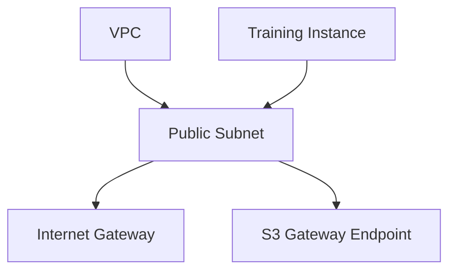
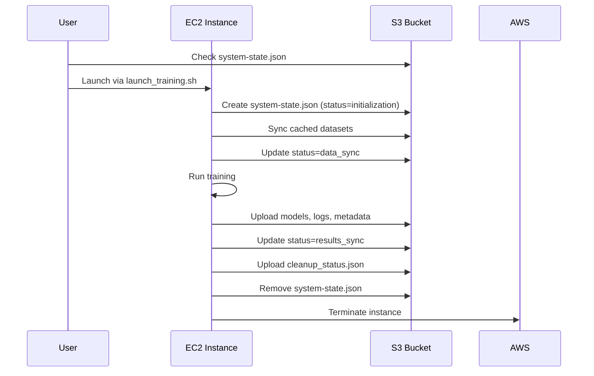
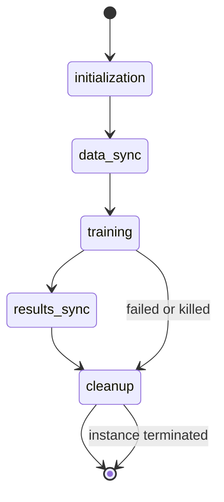

# Chronos Training System — Unified Overview

## 1. Purpose and Scope

The Chronos Training System provides a minimal, cost-efficient way to train Chronos forecasting models on AWS EC2 GPU instances.
It is a single-user, ephemeral training platform that launches, executes, and cleans up training runs automatically.

The design emphasizes simplicity, reproducibility, and zero idle cost. It avoids long-lived infrastructure such as NAT Gateways, CloudWatch dashboards, or persistent compute clusters.

**MVP Design Principle:**
Every training run must be self-contained, complete, and deleted afterward.
Between runs, the system must incur **$0 in idle cost.**

---

## 2. System Summary

### Functional Model

1. The user runs a local script to launch training (`launch_training.sh`).
2. A temporary EC2 instance is created with GPU capability.
3. The instance synchronizes data and Python environments from S3, runs model training, uploads results, and cleans itself up.
4. The system tracks progress using an atomic state file stored in S3.
5. Once complete, all ephemeral resources terminate, leaving only results and logs in S3.

### Key Principles

* **Single user, single run:** No concurrency. The state file enforces mutual exclusion.
* **Atomic state updates:** Prevents partial writes or race conditions.
* **Ephemeral compute:** Instances and volumes are deleted after each run.
* **S3-based monitoring:** No CloudWatch; monitoring relies solely on S3 JSON artifacts.
* **Cost control:** ~$2–4 per run; $0 otherwise.

---

## 3. Architecture Overview

### High-Level Components

```mermaid
graph TD
  A[Dev Machine] --> B[Launch Script]
  B --> C[(S3 Bucket)]
  B --> D[EC2 Instance (Training)]
  D --> C
  D --> E[Cleanup Script]
  E --> C
```

* **Developer Machine:** Runs management scripts.
* **S3 Bucket:** Acts as data plane and control plane. Stores datasets, models, logs, and state files.
* **EC2 Instance:** GPU-based compute for training. Created and destroyed for each run.
* **Scripts:** Automate launch, monitoring, termination, and cleanup.

### Networking



**MVP Network:**

* One VPC with a public subnet.
* Internet Gateway for outbound package installation.
* S3 Gateway Endpoint for zero-cost data transfer.
* Security Group allows HTTPS egress only (no inbound).

**No NAT Gateway.** Eliminated to avoid idle cost and complexity.

---

## 4. Infrastructure (CDK Stack)

All persistent resources are deployed once using AWS CDK.

| Component               | Purpose                                   | Cost     | Lifecycle  |
| ----------------------- | ----------------------------------------- | -------- | ---------- |
| **VPC**                 | Network boundary                          | Free     | Persistent |
| **Public Subnet**       | Launch training EC2 instances             | Free     | Persistent |
| **Internet Gateway**    | Outbound internet access                  | Free     | Persistent |
| **S3 Gateway Endpoint** | Free S3 data access                       | Free     | Persistent |
| **S3 Bucket**           | Stores data, models, and logs             | Variable | Persistent |
| **IAM Role**            | Grants EC2 S3 access and self-termination | Free     | Persistent |
| **Security Group**      | Allows HTTPS outbound only                | Free     | Persistent |

Ephemeral components such as EC2 instances, EBS volumes, and state files are **not created by CDK** — they are managed by runtime scripts.

---

## 5. Data Layout in S3

```
s3://chronos-training-{env}-{account}-{region}/
├── cached-datasets/              # Read-only training data
│   ├── python-env/               # Pre-built Python environments
│   │   └── chronos-venv-3.11.13.tar.gz
│   └── YYYY/MM/                 # Parquet datasets
└── {env}/                        # Environment-scoped data (dev/stage/prod)
    ├── logs/                    # Run-scoped logs
    │   └── {run_id}/
    │       ├── training.json
    │       ├── cleanup_status.json
    ├── {run_id}/                # Outputs and metadata
    │   ├── models/
    │   ├── checkpoints/
    │   ├── model_metadata.json
    └── system-state.json        # Active run status (atomic writes)
```

Lifecycle Policy:

* Logs deleted after 14 days.
* Model artifacts: Infrequent Access at 7 days, deleted after 60.
* Cached datasets: retained indefinitely.

---

## 6. Execution Workflow



---

## 7. State Machine Specification

The system’s logic and cleanup behavior are defined by the canonical state machine.



**Valid Status Values:**
`initialization`, `data_sync`, `training`, `results_sync`, `cleanup`, `failed`, `killed`.

Each update overwrites the S3 state file atomically.

### JSON Artifacts

Every run produces three files:

1. `system-state.json` — live status
2. `training.json` — complete execution log
3. `cleanup_status.json` — resource deletion record

Each is written atomically (`.tmp` then move).

---

## 8. Management Scripts

### Local Scripts (run on dev machine)

| Script                | Purpose                                    |
| --------------------- | ------------------------------------------ |
| `launch_training.sh`  | Launches EC2 instance, checks state file   |
| `monitor_training.sh` | Polls state file to show progress          |
| `kill_training.sh`    | Terminates active run and triggers cleanup |
| `verify_cleanup.sh`   | Ensures no orphaned resources remain       |

### Instance Scripts (run on EC2)

| Script         | Purpose                                               |
| -------------- | ----------------------------------------------------- |
| `bootstrap.sh` | Sets up environment, validates GPU, starts training   |
| `cleanup.sh`   | Uploads logs, deletes state file, terminates instance |

---

## 9. Error Handling

Errors fall into three categories:

| Type          | Example                | Action                              |
| ------------- | ---------------------- | ----------------------------------- |
| **Retriable** | S3 timeout, throttling | Retry 3 times (exponential backoff) |
| **Terminal**  | IAM denied, bad config | Write error, cleanup, terminate     |
| **Cleanup**   | Resource not found     | Log and continue                    |

Cleanup is always idempotent — safe to run multiple times.

---

## 10. Security Model

* **No inbound access:** EC2 security group allows egress HTTPS only.
* **IAM roles:** EC2 instance uses least-privilege role for S3 access and self-termination.
* **S3 encryption:** Server-side encryption (SSE-S3).
* **No stored credentials:** All authentication via IAM instance profile.

---

## 11. Cost Model

| Component        | Cost         | Notes                    |
| ---------------- | ------------ | ------------------------ |
| EC2 g4dn.2xlarge | ~$2–4 / run  | GPU instance (2–4 hours) |
| EBS Volume       | ~$0.02 / run | 100 GB gp3, auto-delete  |
| Internet egress  | ~$0.04 / run | Package install traffic  |
| S3 data transfer | $0           | Gateway endpoint         |
| Idle resources   | $0 / month   | Persistent infra is free |

---

## 12. Developer Responsibilities

**Core Deliverables:**

1. Launch–Monitor–Kill scripts fully operational.
2. State machine implemented with atomic writes.
3. CDK stack deployed for VPC, S3, IAM, and SG.
4. S3 lifecycle rules enforced.
5. Cleanup verified via `verify_cleanup.sh`.

All other features (snapshots, cost dashboards, unified registry) are deferred.

---

## 13. Deferred Features (Phase 2)

Planned but excluded from MVP:

| Feature                          | Reason Deferred                                    |
| -------------------------------- | -------------------------------------------------- |
| **NAT Gateway (Private Subnet)** | Adds cost; not needed for single-user runs         |
| **CloudWatch Monitoring**        | Increases complexity; S3 logs are sufficient       |
| **Snapshot Cache**               | Useful for frequent runs; unnecessary for 1–2/week |
| **Unified Run Registry**         | Overkill for single user                           |
| **Automated Cost Reports**       | Manual review sufficient                           |
| **Advanced Config Validation**   | Deferred until multi-user use case                 |

Each deferred item has a low implementation risk but is postponed for simplicity.

---

## 14. Verification Checklist

| Check                  | Expected Outcome                             |
| ---------------------- | -------------------------------------------- |
| Launch script runs     | EC2 instance visible, state = initialization |
| Monitor script updates | S3 shows correct status                      |
| Kill script works      | Instance terminates, cleanup_status uploaded |
| verify_cleanup.sh      | Reports no active instances                  |
| S3 cost                | <$0.05 idle per month                        |

---

## 15. Summary

The Chronos Training System is a minimal, fully AWS-native training orchestration tool.
It prioritizes zero idle cost, clear state management, and fast prototyping.
The design philosophy follows three rules:

1. **Everything ephemeral.**
2. **All state in S3.**
3. **Nothing left behind.**

**Resource Tagging Philosophy:**
All AWS resources are tagged with `Project=Chronos-Training`, `Environment={dev|stage|prod}`, and `CostCenter={collect|train|serve}`. This tagging strategy enables cost allocation by workload type (answering "how much does training cost?"), supports multi-environment deployment (dev→stage→prod progression), and facilitates cross-account resource migration without code changes.

This document represents the unified source for onboarding engineers and product managers.
All technical details, behavior, and implementation steps trace back to the state machine and orchestration model described above.
