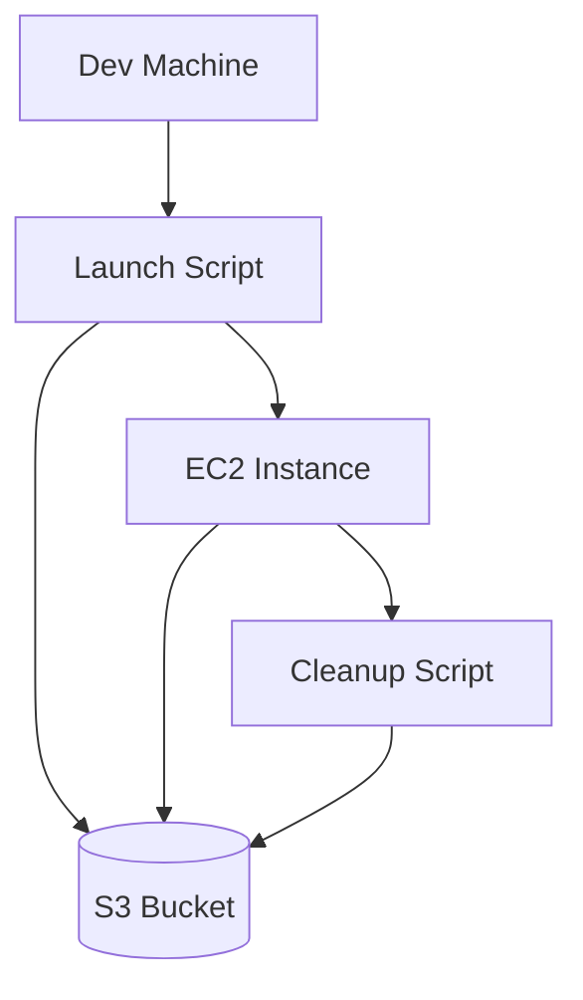

# Chronos Training System — Unified Overview

## 1. Purpose and Scope

The Chronos Training System provides a minimal, cost-efficient way to train Chronos forecasting models on AWS EC2 GPU instances. It is a single-user, ephemeral training platform that launches, executes, and cleans up training runs automatically.

**MVP Design Principle:** Every training run must be self-contained, complete, and deleted afterward. Between runs, the system must incur **$0 in idle cost.**

---

## 2. System Summary

### Functional Model

1. The user runs a local script to launch training (`launch_training.sh`).
2. A temporary EC2 instance is created with GPU capability.
3. The instance synchronizes data and Python environments from S3, runs model training, uploads results, and cleans itself up.
4. The system tracks progress using an atomic state file stored in S3.
5. Once complete, all ephemeral resources terminate, leaving only results and logs in S3.

### Key Principles

* **Single user, single run:** No concurrency. The state file enforces mutual exclusion.
* **Atomic state updates:** Prevents partial writes or race conditions.
* **Ephemeral compute:** Instances and volumes are deleted after each run.
* **S3-based monitoring:** No CloudWatch; monitoring relies solely on S3 JSON artifacts.
* **Cost control:** ~$2–4 per run; $0 otherwise.

---

## 3. MVP Must-Have Capabilities

| Epic | User Need | MVP Acceptance Criteria |
|------|-----------|--------------------------|
| **Training Execution** | Launch training with single command | `launch_training.sh` checks for existing sessions; EC2 launches automatically |
| | Monitor progress in real-time | `monitor_training.sh` shows current step; updates every 30 seconds |
| | Emergency termination | `kill_training.sh` stops training; resources cleaned up |
| **State Management** | Prevent concurrent runs | Error if training already running; state file locking |
| | Track training progress | See current step (init/sync/train/cleanup); timestamps |
| | Handle failures gracefully | Clear error messages; partial results preserved; cleanup |
| **Resource Management** | Automatic cleanup | EC2 terminates after training; EBS DeleteOnTermination; `verify_cleanup.sh` |
| **Data Management** | Auto-sync training data | Cached datasets from S3; retry on failed sync |
| **Security** | Secure data access | IAM roles; S3 encryption at rest/transit; least privilege |

See [System Architecture](system-architecture.md) for detailed design. See [Future Enhancements](future-enhancements.md) for deferred features.

---

## 4. Architecture Overview

### High-Level Components

```mermaid
graph TD
  A[Dev Machine] --> B[Launch Script]
  B --> C[(S3 Bucket)]
  B --> D[EC2 Instance]
  D --> C
  D --> E[Cleanup Script]
  E --> C
```

* **Developer Machine:** Runs management scripts.
* **S3 Bucket:** Data plane and control plane. Stores datasets, models, logs, state files.
* **EC2 Instance:** GPU compute. Created and destroyed per run.
* **Scripts:** Launch, monitor, terminate, cleanup.

### Networking

One VPC with public subnet. Internet Gateway for outbound. S3 Gateway Endpoint for zero-cost S3 access. Security Group: HTTPS egress only (no inbound). **No NAT Gateway.**

---

## 5. Infrastructure (CDK Stack)

| Component | Purpose | Cost |
|-----------|---------|------|
| VPC, Public Subnet | Network boundary | Free |
| Internet Gateway | Outbound access | Free |
| S3 Gateway Endpoint | Free S3 data access | Free |
| S3 Bucket | Data, models, logs | Variable |
| IAM Role | EC2 S3 access, self-termination | Free |
| Security Group | HTTPS egress only | Free |

Ephemeral EC2 instances and EBS volumes are managed by runtime scripts, not CDK.

---

## 6. Data Layout and State

**S3 layout:** See [System Architecture](system-architecture.md) for canonical structure. Summary: `cached-datasets/` (read-only), `{env}/` (outputs, state, logs).

**State machine:** See [State Machine](state-machine.md) for canonical spec. Valid statuses: `initialization`, `data_sync`, `training`, `results_sync`, `cleanup`, `failed`, `killed`. Three JSON artifacts per run: `system-state.json`, `training.json`, `cleanup_status.json`.

---

## 7. Management Scripts

| Script | Purpose |
|--------|---------|
| `launch_training.sh` | Launch EC2, check state file |
| `monitor_training.sh` | Poll state file for progress |
| `kill_training.sh` | Terminate active run, trigger cleanup |
| `verify_cleanup.sh` | Ensure no orphaned resources |

Instance scripts: `bootstrap.sh` (setup, GPU validation, training), `cleanup.sh` (upload logs, terminate).

---

## 8. Cost Model

EC2 g4dn.2xlarge ~$2–4/run. EBS ~$0.02/run. S3 transfer $0 (Gateway Endpoint). **Idle: $0/month.**

---

## 9. Summary

Three rules: **Everything ephemeral. All state in S3. Nothing left behind.**

Resource tagging: `Project=Chronos-Training`, `Environment={dev|stage|prod}`, `CostCenter={collect|train|serve}`.
