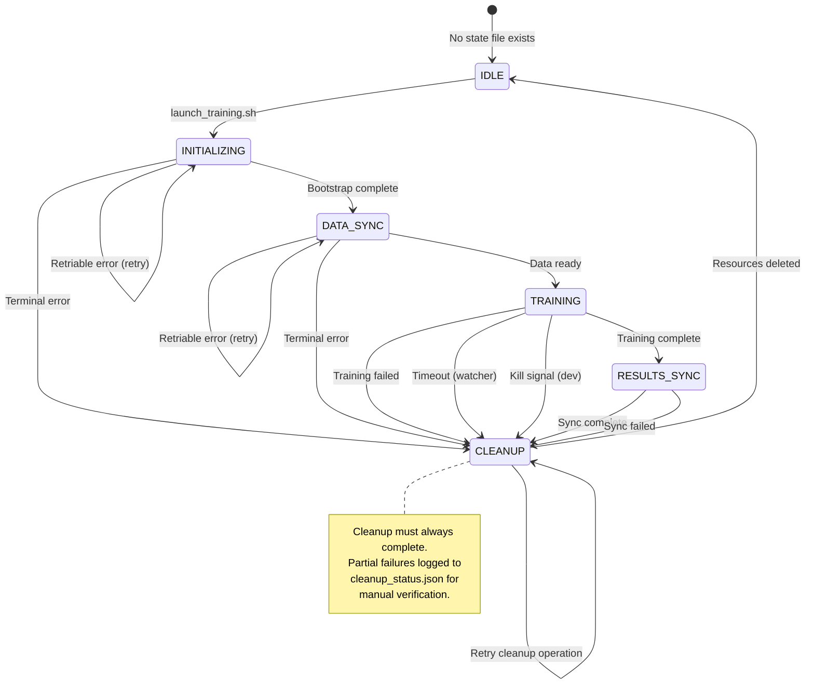

# Canonical State Machine Specification

## Overview

This document is the **single source of truth** for state management, error handling, and cleanup semantics in the Chronos training system. All other design documents reference this specification rather than duplicating these definitions.

**MVP Scope**: This specification reflects the simplified MVP approach with public subnet networking, 3 JSON artifacts, and minimal resource management. For deferred features (NAT Gateway, snapshot-cache, unified registry, etc.), see [Future Enhancements](future-enhancements.md).

**Atomic State Writes**: All state file writes must be atomic. Always write to a temporary file first (`system-state.tmp`), then move/overwrite to the final location (`system-state.json`). This ensures the monitoring script never reads a partial/corrupt state file.

## State File Specification (CANONICAL)

### Location

`s3://bucket/phase1/system-state.json`

**Atomic Write Pattern**: Always write to `system-state.tmp`, then `aws s3 mv` to `system-state.json`. This ensures atomic updates visible to monitoring scripts.

### Structure

```json
{
  "status": "training",
  "instance_id": "i-xxxxx",
  "current_step": "training",
  "run_id": "20240315-143022",
  "timestamps": {
    "start": "2024-03-15T14:30:22Z",
    "initialization": "2024-03-15T14:32:15Z",
    "data_sync": "2024-03-15T14:35:40Z",
    "training_start": "2024-03-15T14:36:00Z",
    "training_end": null,
    "cleanup": null
  },
  "training_config": {
    "instance_type": "g4dn.2xlarge",
    "dataset": "2010-01",
    "model_types": ["ChronosZeroShot", "AutoETS"]
  },
  "error_message": null
}
```

**MVP Simplification**: No NAT Gateway or Elastic IP tracking needed (public subnet approach).

### Status Values

| Status          | Meaning                                    | Next States                        |
|-----------------|--------------------------------------------|------------------------------------|
| `initialization`| EC2 starting, dependencies installing      | `data_sync`, `failed`              |
| `data_sync`     | Syncing cached datasets from S3            | `training`, `failed`               |
| `training`      | Model training in progress                 | `results_sync`, `failed`, `killed` |
| `results_sync`  | Uploading results to S3                    | `cleanup`, `failed`                |
| `cleanup`       | Deleting ephemeral resources               | (file deleted on success)          |
| `failed`        | Terminal failure occurred                  | `cleanup`                          |
| `killed`        | User or watcher triggered kill             | `cleanup`                          |

## State Machine with Error Edges



## Authority Matrix

### Write/Read Authority

| Phase          | State File Writer | State File Reader | Timeout Authority | Kill Authority    |
|----------------|-------------------|-------------------|-------------------|-------------------|
| IDLE           | None              | launch script     | N/A               | N/A               |
| INITIALIZING   | EC2 bootstrap     | Dev monitor       | N/A (boot time)   | Dev kill script   |
| DATA_SYNC      | EC2 bootstrap     | Dev monitor       | N/A (fast phase)  | Dev kill script   |
| TRAINING       | Training process  | Dev monitor       | Watcher (12 hrs)  | Dev kill script   |
| RESULTS_SYNC   | Training process  | Dev monitor       | N/A (fast phase)  | Dev kill script   |
| CLEANUP        | Cleanup script    | Dev verify script | N/A (must finish) | None (must finish)|

### Resource Ownership

| Resource        | Created By      | Tracked In           | Deleted By      | Verified By         |
|-----------------|-----------------|----------------------|-----------------|---------------------|
| EC2 Instance    | launch script   | state.instance_id    | Cleanup script  | verify_cleanup.sh   |
| EBS Volumes     | CDK/Launch      | EC2 tags             | Auto (DeleteOnTermination) | verify_cleanup.sh |
| State File      | Bootstrap       | S3 path              | Cleanup script  | Manual check        |

**MVP Note**: NAT Gateway and Elastic IP removed - using public subnet approach for simplicity.

## Error Classification System

All errors are classified into three categories that determine response actions.

### Retriable Errors

**Characteristics:**
- Transient failures that may succeed on retry
- Network issues, service throttling, timing issues
- Retry with exponential backoff, max 3 attempts

**Error Classes:**

| Error                    | Detection Point | Retry Strategy              | On Exhaustion           | Example                |
|--------------------------|-----------------|-----------------------------|-----------------------|------------------------|
| S3 throttling (503)      | Data sync       | 5s, 15s, 45s exponential    | CLEANUP + terminate   | RequestLimitExceeded   |
| NAT Gateway not ready    | Bootstrap       | 30s × 3                     | CLEANUP + terminate   | InvalidNatGatewayID    |
| S3 sync timeout          | Data/Results    | 10s, 30s, 90s exponential   | CLEANUP + terminate   | Connection timeout     |
| EBS snapshot in progress | Cleanup         | 60s × 5                     | Log + continue        | SnapshotInUseBySnapshot|
| Route table conflict     | NAT creation    | 15s × 3                     | CLEANUP + terminate   | InvalidRouteTableID    |

**Response Pattern:**

```bash
for attempt in 1 2 3; do
  if operation_succeeds; then
    break
  else
    if [ $attempt -lt 3 ]; then
      sleep $((5 * 2**attempt))  # Exponential backoff
    else
      log_error "Max retries exhausted"
      trigger_cleanup
      exit 1
    fi
  fi
done
```

### Terminal Errors

**Characteristics:**
- Permanent failures that cannot be retried
- Configuration errors, permission issues, quota limits
- No retry - immediate cleanup and termination

**Error Classes:**

| Error                      | Detection Point | Action                                      | Artifact Written                  | Dev Action Required       |
|----------------------------|-----------------|---------------------------------------------|-----------------------------------|---------------------------|
| IAM permission denied      | Any phase       | Write error to phase log → upload → CLEANUP | `logs/<run_id>/<phase>.json`      | Fix IAM role              |
| EC2 quota exceeded         | Launch          | Abort launch → notify dev                   | None (never started)              | Request quota increase    |
| GPU not available          | Preflight       | Write error → upload → CLEANUP              | `logs/<run_id>/preflight.json`    | Check instance type       |
| Invalid config schema      | Bootstrap       | Write error → upload → CLEANUP              | `logs/<run_id>/bootstrap.json`    | Fix config file           |
| VPC/subnet not found       | NAT creation    | Write error → upload → CLEANUP              | `logs/<run_id>/bootstrap.json`    | Check CDK deployment      |
| S3 bucket access denied    | Data sync       | Write error → upload → CLEANUP              | `logs/<run_id>/data_sync.json`    | Fix bucket policy         |

**Response Pattern:**

```bash
if ! check_preconditions; then
  ERROR_MSG="Precondition failed: IAM permissions"
  echo "{\"error\": \"$ERROR_MSG\", \"timestamp\": \"$(date -u +%Y-%m-%dT%H:%M:%SZ)\"}" > /tmp/logs/preflight.json
  aws s3 cp /tmp/logs/preflight.json s3://bucket/phase1/logs/${RUN_ID}/preflight.json
  update_state_file "status=failed" "error_message=$ERROR_MSG"
  trigger_cleanup
  exit 1
fi
```

### Cleanup Errors

**Characteristics:**
- Errors during resource cleanup/deletion
- Should never block completion of cleanup
- Log and continue - manual verification available

**Error Classes:**

| Error                      | Action                                          | Logged To                       | Cost Impact       |
|----------------------------|-------------------------------------------------|---------------------------------|-------------------|
| NAT Gateway already deleted| Log "NAT GW not found" → continue               | `cleanup_status.json`           | None              |
| NAT Gateway deleting       | Wait 60s × 3 → log status → continue            | `cleanup_status.json`           | ~$0.03 max        |
| EIP not found              | Log "EIP missing" → continue                    | `cleanup_status.json`           | None              |
| EIP still associated       | Log "EIP attached" → continue (will release later)| `cleanup_status.json`         | ~$0.01/day until manual release |
| EBS volume delete fails    | Log error → continue                            | `cleanup_status.json`           | ~$0.01/hour until manual delete |
| Route table update fails   | Log error → continue (NAT GW deletion will clean) | `cleanup_status.json`         | None (route orphaned but harmless) |
| State file delete fails    | Log error → continue (eventual consistency)     | `cleanup_status.json`           | None              |

**Response Pattern:**

```bash
# All cleanup operations must be idempotent
cleanup_nat_gateway() {
  if aws ec2 describe-nat-gateways --nat-gateway-ids $NAT_GW &>/dev/null; then
    aws ec2 delete-nat-gateway --nat-gateway-id $NAT_GW || {
      log_to_cleanup_status "nat_gateway_delete_failed" "$NAT_GW"
    }
  else
    log_to_cleanup_status "nat_gateway_not_found" "$NAT_GW"
  fi
}
```

## Required Artifacts (MVP - 3 Files)

Every training run **must** produce these JSON artifacts uploaded to `s3://bucket/phase1/logs/<run_id>/`:

**MVP Simplification**: Reduced from 5 detailed phase logs to 3 essential files. Granular phase tracking (preflight, data_sync, results_sync) is incorporated into `training.json`. Advanced per-phase artifacts can be added in Phase 2 if needed.

### 1. system-state.json

**Created by:** bootstrap.sh, updated throughout execution
**Purpose:** Current training status for monitoring
**Required fields:** See "State File Structure" above
**Atomic Writes**: Always write to `system-state.tmp`, then move to `system-state.json`

### 2. training.json

**Created by:** training process
**Purpose:** Complete training execution log with all phases (preflight, data_sync, training, results_sync)
**Required fields:**
**Atomic Writes**: Write to `training.tmp`, then move to `training.json` before uploading to S3

```json
{
  "run_id": "20240315-143022",
  "phases": {
    "preflight": {
      "status": "pass" | "fail",
      "duration_seconds": 15,
      "cuda_available": true,
      "venv_hash": "sha256:xxxxx"
    },
    "data_sync": {
      "status": "pass" | "fail",
      "duration_seconds": 180,
      "bytes_synced": 10737418240,
      "retry_count": 0
    },
    "training": {
      "status": "pass" | "fail",
      "duration_seconds": 7770,
      "exit_code": 0,
      "models_trained": ["ChronosZeroShot", "AutoETS"],
      "error": null
    },
    "results_sync": {
      "status": "pass" | "fail",
      "duration_seconds": 155,
      "bytes_uploaded": 5368709120
    }
  },
  "total_duration_seconds": 8120,
  "timestamp_start": "2024-03-15T14:30:22Z",
  "timestamp_end": "2024-03-15T16:48:10Z"
}
```

### 3. cleanup_status.json

**Created by:** cleanup.sh
**Purpose:** Track every resource deletion attempt
**Required fields:**
**Atomic Writes**: Write to `cleanup_status.tmp`, then move to `cleanup_status.json` before uploading to S3

```json
{
  "timestamp_start": "2024-03-15T16:48:15Z",
  "timestamp_end": "2024-03-15T16:50:30Z",
  "run_id": "20240315-143022",
  "instance_id": "i-xxxxx",
  "resources": {
    "ec2_instance": {
      "id": "i-xxxxx",
      "status": "terminated" | "terminating" | "failed",
      "error": null,
      "timestamp": "2024-03-15T16:48:20Z"
    },
    "ebs_volumes": [
      {
        "volume_id": "vol-xxxxx",
        "status": "deleted" | "deleting" | "failed",
        "error": null,
        "timestamp": "2024-03-15T16:48:45Z",
        "note": "DeleteOnTermination=true, auto-deleted with instance"
      }
    ],
    "state_file": {
      "status": "deleted" | "failed",
      "error": null,
      "timestamp": "2024-03-15T16:50:28Z"
    }
  },
  "manual_action_required": false | true,
  "estimated_orphaned_cost_per_hour": 0.00
}
```

**MVP Simplification**: No NAT Gateway or Elastic IP fields needed. EBS volumes auto-delete with instance termination (DeleteOnTermination=true).

**Example Atomic Write Pattern:**
```bash
# Write atomically to avoid corrupt state
cat > /tmp/cleanup_status.tmp <<EOF
{
  "timestamp_start": "$(date -u +%Y-%m-%dT%H:%M:%SZ)",
  "run_id": "$RUN_ID",
  ...
}
EOF
aws s3 cp /tmp/cleanup_status.tmp s3://bucket/phase1/logs/${RUN_ID}/cleanup_status.json
```

## Idempotent Cleanup Contract

All cleanup operations **must** be idempotent and safe to re-run multiple times.

### Pattern: Check Before Delete

```bash
# BAD: Fails if resource doesn't exist
aws ec2 terminate-instances --instance-ids $INSTANCE_ID

# GOOD: Idempotent
if aws ec2 describe-instances --instance-ids $INSTANCE_ID --query 'Reservations[0].Instances[0].State.Name' --output text 2>/dev/null | grep -qv 'terminated'; then
  echo "Terminating instance $INSTANCE_ID..."
  aws ec2 terminate-instances --instance-ids $INSTANCE_ID || log_cleanup_error "instance_terminate_failed"
else
  echo "Instance $INSTANCE_ID already terminated"
  log_cleanup_info "instance_already_terminated"
fi
```

### Pattern: Wait for State Transition (MVP - Simple Case)

```bash
# Wait for EC2 instance to finish terminating
aws ec2 terminate-instances --instance-ids $INSTANCE_ID

# Wait up to 2 minutes for termination
for i in {1..24}; do
  STATE=$(aws ec2 describe-instances --instance-ids $INSTANCE_ID --query 'Reservations[0].Instances[0].State.Name' --output text 2>/dev/null)
  if [ "$STATE" = "terminated" ]; then
    echo "Instance terminated successfully"
    break
  fi
  sleep 5
done

# EBS volumes with DeleteOnTermination=true will auto-delete
log_cleanup_info "volumes_auto_deleted"
```

**Note**: NAT Gateway/EIP pattern deferred to Phase 2 (see [Future Enhancements](future-enhancements.md)).

### Pattern: Log All Outcomes

```bash
cleanup_resource() {
  RESOURCE_TYPE=$1
  RESOURCE_ID=$2

  if resource_exists "$RESOURCE_ID"; then
    if delete_resource "$RESOURCE_ID"; then
      log_to_cleanup_status "$RESOURCE_TYPE" "$RESOURCE_ID" "deleted" null
    else
      log_to_cleanup_status "$RESOURCE_TYPE" "$RESOURCE_ID" "failed" "$ERROR_MSG"
    fi
  else
    log_to_cleanup_status "$RESOURCE_TYPE" "$RESOURCE_ID" "not_found" null
  fi
}
```

## Cleanup Verification

After cleanup completes, the `verify_cleanup.sh` script can be run to ensure no cost-generating resources remain.

### Verification Checklist

| Resource        | Verification Method                          | Cost if Orphaned   | Urgency        |
|-----------------|----------------------------------------------|-------------------|----------------|
| EC2 Instance    | `aws ec2 describe-instances --filters`       | $1-2/hour         | Critical (5 min)|
| EBS Volumes     | `aws ec2 describe-volumes --filters`         | $0.01/hour        | Low (auto-deleted with DeleteOnTermination=true) |
| State File      | `aws s3 ls s3://bucket/phase1/system-state.json` | None         | Low            |

**MVP Note**: No NAT Gateway, Elastic IP, or EBS snapshots to verify. System uses public subnet approach with minimal cleanup complexity.

### Manual Remediation

If `cleanup_status.json` indicates manual action required:

1. Read the cleanup status artifact
2. Identify failed resource deletions
3. Use AWS console or CLI to manually delete resources
4. Update cleanup status if needed
5. Re-run `verify_cleanup.sh` to confirm

## Related Documentation

- [Training Orchestration](training-orchestration.md) - Execution workflow and resource management
- [CDK Implementation](cdk-implementation.md) - Infrastructure as code
- [Usage Guide](../user-guides/usage-guide.md) - User-facing operations and troubleshooting

