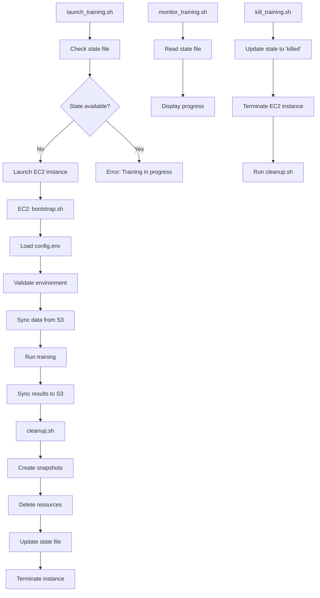
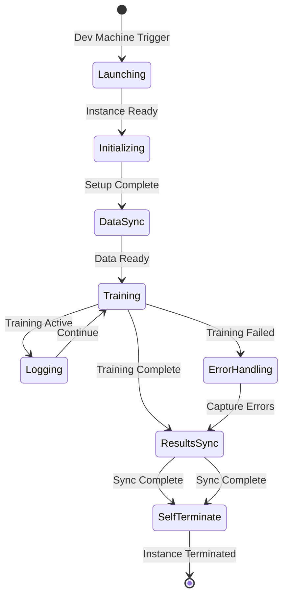
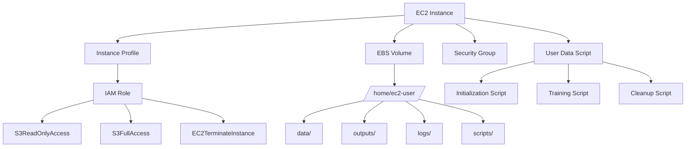
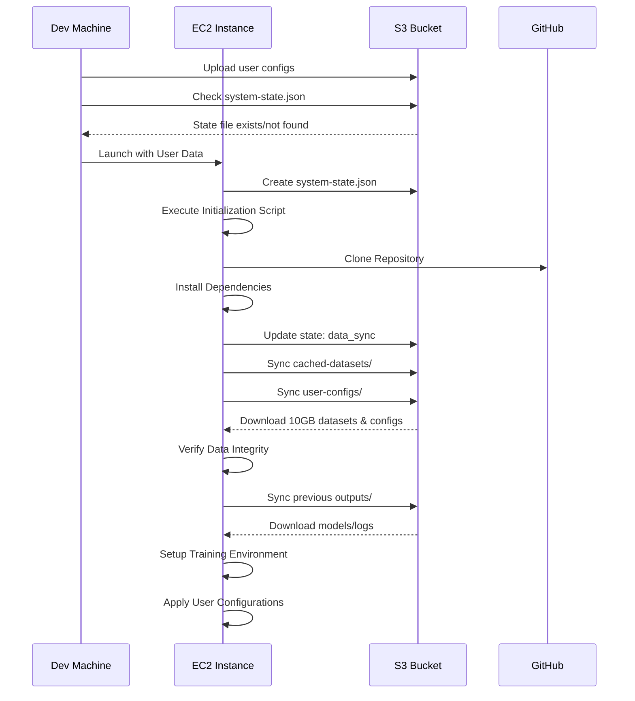
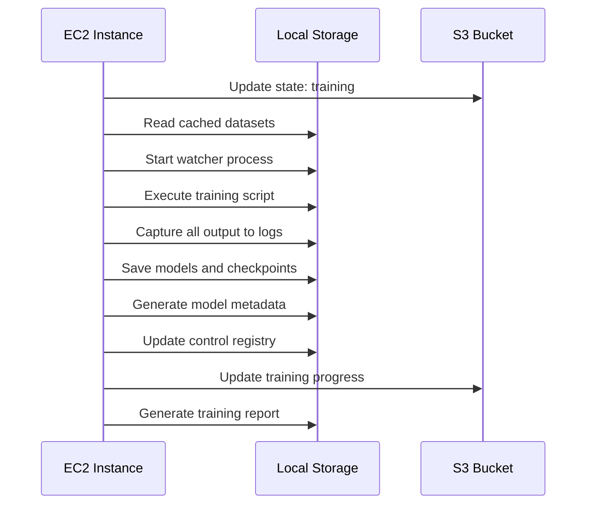
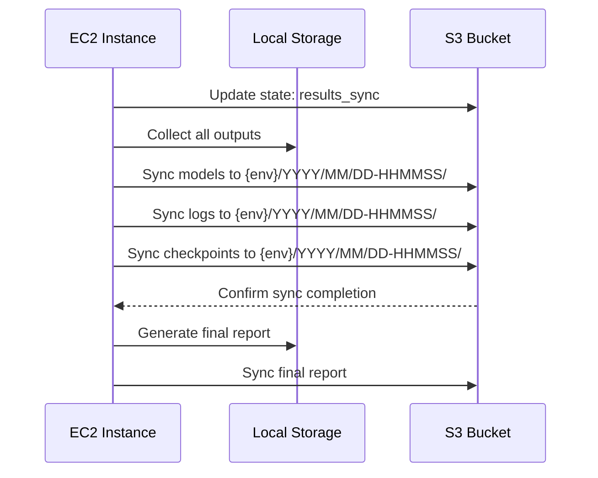
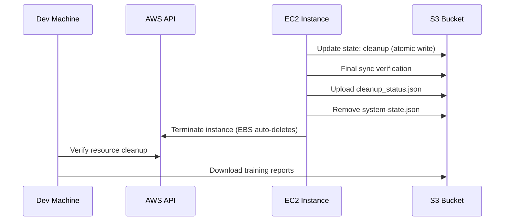
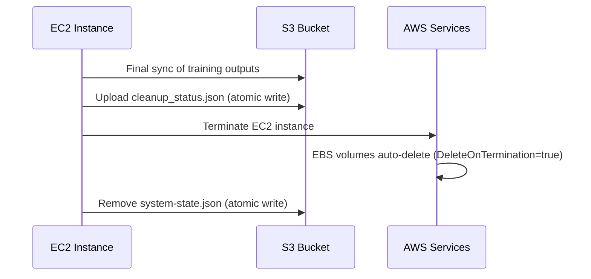
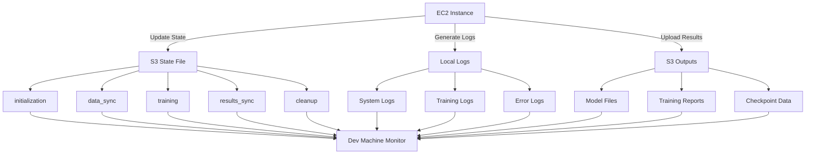

# EC2 Training Orchestration Design Document

## Overview

This document describes the complete orchestration system for training Chronos models on AWS EC2 instances. The system manages the entire lifecycle from instance launch through training execution to automatic cleanup, with S3-based data synchronization and state file monitoring.

**MVP Scope**: This system uses public subnet networking ($0 idle cost), S3-only monitoring, and 3 JSON artifacts per run. Advanced features (NAT Gateway, snapshot-cache, CloudWatch) deferred to Phase 2 (see [Future Enhancements](future-enhancements.md)).

**Note**: For canonical state management, error handling, and cleanup semantics, see [State Machine](state-machine.md). This document provides execution workflow, S3 data flow, and resource management details.

## System Architecture

### Complete System Overview

```mermaid
graph TB
    subgraph "Dev Machine"
        A[launch_training.sh]
        B[monitor_training.sh]
        C[kill_training.sh]
        D[config.env]
    end

    subgraph "S3 Bucket (Data/Control Plane)"
        E[cached-datasets/]
        F[{env}/YYYY/MM/DD-HHMMSS/]
        G[system-state.json]
        H[control_registry.json]
    end

    subgraph "EC2 Instance (Runtime)"
        I[bootstrap.sh]
        J[cleanup.sh]
        K[Training Process]
        L[EBS Volume]
    end

    subgraph "AWS Resources"
        M[NAT Gateway]
        N[Elastic IP]
        O[EBS Snapshots]
    end

    A -->|Launch| I
    A -->|Check State| G
    B -->|Monitor| G
    C -->|Kill| I
    D -->|Config| A

    I -->|Sync Data| E
    I -->|Update State| G
    I -->|Store Results| F
    I -->|Create Snapshots| O
    J -->|Cleanup Resources| M
    J -->|Cleanup Resources| N
    J -->|Update Registry| H

    K -->|Read/Write| L
    L -->|Snapshot| O

    style A fill:#e1f5fe
    style E fill:#f3e5f5
    style I fill:#e8f5e8
    style M fill:#fff3e0
```

**System Flow**: Dev machine launches training via `launch_training.sh` → EC2 instance runs `bootstrap.sh` → Syncs data from S3 → Executes training → Stores results in S3 → Runs `cleanup.sh` → Terminates instance. State file prevents concurrent runs and tracks progress.

### Script Execution Flow



### Complete Training Orchestration



### EC2 Instance Lifecycle


## EC2 Instance Management

### Instance Configuration



### Instance Types and Sizing

The system supports multiple EC2 instance types optimized for different training scenarios. For CPU-only training, the system uses `c5.2xlarge` instances with 8 vCPUs and 16GB RAM, providing sufficient compute power for AutoGluon training.

For GPU-accelerated training, the system uses `g4dn.2xlarge` instances with 1x NVIDIA T4 GPU, 8 vCPUs, and 32GB RAM. This configuration provides optimal performance for Chronos fine-tuning.

EBS storage is configured with 100GB gp3 volumes providing 3,000 IOPS and 125 MB/s throughput. This configuration ensures sufficient storage for cached datasets, training outputs, and temporary files while maintaining good I/O performance for data-intensive operations.

### Security Configuration (MVP: Public Subnet)

The system implements security through VPC configuration, security groups, and IAM roles. EC2 instances are launched in public subnet with ephemeral public IPs but no inbound access.

**Network Security Architecture (MVP)**:
- **Public Subnet**: EC2 instances run in public subnet with ephemeral public IPs
- **No Inbound Rules**: Security group allows zero inbound traffic (no SSH, no ports exposed)
- **Egress HTTPS Only**: Outbound traffic restricted to port 443 only
- **S3 Gateway Endpoint**: Free, direct access to S3 (zero data transfer cost)
- **Internet Gateway**: For pip/apt/git package installation (~$0.04/run internet egress)

**Why Public Subnet is Secure**:
- No inbound SG rules = instance cannot be accessed remotely
- Ephemeral instance (2-4 hours max lifespan)
- Single-user system (not multi-tenant)
- Public IP is effectively "scan-only" - no services listening

**Data Path Routing**:
- S3 traffic (10GB+ per run) routes through S3 Gateway Endpoint (zero data transfer cost)
- Internet traffic (pip install, GitHub) routes through Internet Gateway (~500MB, ~$0.04/run)

**Idle Cost**: $0/month (VPC, IGW, S3 endpoint all free)

**IAM Roles**: Least privilege with S3 read-only (cached datasets), S3 read-write (phase1 outputs), EC2 self-termination only.

**Note**: Private subnet with ephemeral NAT Gateway available in Phase 2 for compliance scenarios (see [Future Enhancements](future-enhancements.md)).

## S3 Data Flow and Storage

### S3 Bucket Structure

```
s3://chronos-training-{account}-{region}/
├── cached-datasets/              # Read-only training data (immutable)
│   ├── training-data/            # Parquet files synced to EC2 /data/
│   │   ├── 2010/01/             # Parquet files by year/month
│   │   ├── 2010/02/
│   │   └── ...                   # Additional date-based directories
│   ├── configs/                 # EC2 config files synced to /opt/heisenberg-engine/config/
│   │   ├── parquet_loader_config.yaml
│   │   ├── train.yaml
│   │   ├── covariate_config.yaml
│   │   └── incremental_training_config.yaml
│   ├── scripts/                 # Bootstrap and training scripts
│   │   ├── bootstrap.sh
│   │   ├── preflight_check.py
│   │   ├── training_wrapper.py
│   └── python-env/              # Pre-built .venv archives
│       └── chronos-venv-3.11.13.tar.gz
│
├── runtime/                      # Mutable runtime resources (write access)
│   ├── python-env/              # Alternative location (legacy)
│   └── scripts/                  # Alternative location (legacy)
│       └── lib/
│           └── state_helpers.sh
│
├── dev/                          # Dev environment training runs
├── stage/                        # Stage environment training runs
└── prod/                         # Prod environment training runs
    ├── 2024/10/05-143022/       # Timestamped run directory
    │   ├── models/              # Trained model artifacts
    │   ├── checkpoints/         # Training checkpoints
    │   ├── user-configs/        # User-provided configs
    │   └── model_metadata.json  # Run metadata
    ├── logs/                    # Run-scoped logs
    │   └── 2024-10-05-143022/
    │       ├── training.json          # Complete execution log
    │       └── cleanup_status.json    # Cleanup tracking
    └── system-state.json        # Current run state (atomic writes)
```

### Data Sync Operations

**Sync Direction**:
- **cached-datasets/** → EC2: Read-only (training data - date-based parquet files)
- **runtime/** → EC2: Read-only (Python env, bootstrap scripts)
- **{env}/** ← EC2: Write-only (dev/, stage/, prod/ - outputs, logs, state files)

**Sync Triggers**:
- **Pre-training**: Pull cached datasets from S3 → EBS (~3 minutes for 10GB)
- **Post-training**: Push models/logs from EBS → S3 (~2 minutes for 5GB)
- **No periodic sync**: All sync manual via scripts

**S3 Gateway Endpoint**:
- All S3 traffic routes through VPC Gateway Endpoint (zero data transfer cost)
- 10GB+ per run at $0 (vs ~$1+ without endpoint)

### Data Lifecycle (MVP)

**Ephemeral Data** (Auto-cleanup):
- **Training logs** (`{env}/logs/`): Delete after 14 days (e.g., `dev/logs/`, `prod/logs/`)
- **Model artifacts** (`{env}/`): IA at 30 days, delete at 90 days
- **State files**: Deleted on run completion

**Long-term Data** (Manual management):
- **Cached datasets** (`cached-datasets/`): Indefinite retention (read-only training data)
- **Runtime resources** (`runtime/`): Manual versioning, cleanup old versions as needed (python-env, scripts)

### Data Security

- **Encryption**: S3-managed server-side encryption (SSE-S3)
- **SSL Enforced**: All S3 operations require HTTPS
- **Access Control**: IAM role-based (no bucket policies needed)
- **No Versioning**: KISS principle for MVP

## Execution Workflow

### Phase 1: Instance Initialization



The initialization phase begins with EC2 instance launch using user data scripts that execute automatically upon instance startup. The initialization script installs required dependencies including Python, AutoGluon, and AWS CLI tools. The script then clones the training repository from GitHub using SSH keys configured in the instance profile.

**GPU Preflight (MVP):** Before any data sync, the bootstrap runs a basic GPU check: verify `nvidia-smi` exists and returns success, activate the unpacked `.venv` and assert `torch.cuda.is_available()` is true. On failure: log error, update `system-state.json` to `status=failed`, then terminate. Results included in `training.json` phases array.

Data synchronization occurs in three phases: cached datasets are pulled from the read-only S3 store, user configuration files are synchronized from the dev machine upload, and any existing outputs from previous training runs are synchronized to provide continuity. The system verifies data integrity through basic file count verification.

Configuration management follows a precedence hierarchy where user-uploaded configurations override repository defaults. The system validates all configuration files before applying them to ensure training parameters are correct and compatible with the selected model types.

**MVP Approach: S3 Sync Only:**
- All data pulled from S3 on every run (~3 minutes)
- Root volume with DeleteOnTermination=true
- No EBS snapshots - simple and sufficient for once-every-few-days training

**Snapshot-Cache Strategy deferred to Phase 2**: For frequent training (multiple runs per day), EBS snapshot-cache can reduce boot time from 3 min to 1 min. See [Future Enhancements](future-enhancements.md) for implementation details.

### Phase 2: Training Execution



Training execution begins with data preparation and environment setup. The system reads cached datasets from local storage and initializes the training environment with appropriate Python paths and environment variables. Training scripts execute with comprehensive logging capturing all output to timestamped log files.

The training process includes multiple model types with different computational requirements. Fast models complete in seconds while complex models may require hours of training time. The system monitors training progress through S3 state file updates (written atomically).

During training execution, the system automatically generates minimal model metadata including training timestamps, dataset information, Git commit hash, software versions, and performance metrics. This metadata is stored in a `model_metadata.json` file alongside the model artifacts.

**MVP Approach**: Use timestamped S3 prefixes to track runs. No central registry needed for single-user operation.

**Automatic Timeout Protection (Optional):**
A watcher process can optionally monitor training duration. MVP: watcher off by default. Can be enabled if needed. Full specification deferred to Phase 2 (see [Future Enhancements](future-enhancements.md)).

### Phase 3: Results Synchronization



Results synchronization occurs after training completion regardless of success or failure status. The system collects all training outputs including models, logs, checkpoints, and generated reports. These outputs are synchronized to an environment-scoped timestamped S3 directory using the format `{env}/YYYY/MM/DD-HHMMSS/` (e.g., `dev/2024/10/05-143022/`).

The synchronization process includes retry logic with exponential backoff to handle temporary S3 service issues. The system verifies successful upload of all critical files before proceeding to cleanup operations.

### Phase 4: Automatic Cleanup



## Resource Cleanup (MVP: Simplified)

### Cleanup Sequence

The system implements a simple cleanup sequence to prevent cost accumulation:



### Resource Cleanup Details (MVP)

#### EBS Volume Management (MVP: Auto-Delete)
- **Volume Deletion**: EBS volumes automatically deleted via DeleteOnTermination=true
- **No Snapshots**: MVP uses S3 sync; snapshot-cache deferred to Phase 2

#### Network Cleanup (MVP: Public Subnet)
- **No NAT Gateway**: MVP uses public subnet, no NAT Gateway to clean up
- **Public IP**: Automatically released when instance terminates
- **Cost Verification**: Verify no running instances remain

#### S3 Data Lifecycle (MVP: Simple Policy)
- **Lifecycle Policy**: Single simple rule (IA at 7 days → Glacier at 30 → Delete at 60)
- **Retention Management**: Fixed retention periods
- **Cost Optimization**: Automatic transition to cheaper storage classes

#### Resource Verification
- **Cleanup Status**: Generate cleanup_status.json (atomic write)
- **Resource Inventory**: Track resources before and after cleanup
- **Verification Script**: `verify_cleanup.sh` available

### Cleanup Scripts (MVP)

The system provides basic cleanup scripts:

```bash
# Cleanup script (runs automatically at end of training)
cleanup.sh
- Terminate EC2 instance
- EBS volumes auto-delete (DeleteOnTermination=true)
- Write cleanup_status.json (atomic write)
- Remove system-state.json

# Resource verification (manual, run from dev machine)
verify_cleanup.sh
- Check for orphaned EC2 instances
- Check for orphaned EBS volumes
- Generate cleanup report
```

**Deferred to Phase 2**: EBS snapshot management, NAT Gateway cleanup, advanced lifecycle scripts (see [Future Enhancements](future-enhancements.md)).

### Cost Prevention Measures (MVP)

- **Zero Idle Costs**: All persistent infrastructure (VPC, IGW, S3 endpoint) is free
- **S3 Gateway Endpoint**: Free S3 data transfer for all training data (10GB+ per run)
- **Public Subnet**: No NAT Gateway costs, simple architecture
- **Cost Monitoring**: Manual review via AWS Cost Explorer
- **Resource Tagging**: Tag all resources for cost attribution
- **Automatic Cleanup**: Ensure no orphaned resources (EC2 instances, EBS volumes)
- **Cleanup Verification**: `verify_cleanup.sh` script available

**Cost Breakdown Per Training Run (MVP)**:
- EC2 Instance (g4dn.2xlarge, 2-4 hours): ~$2-4
- EBS Volume (100GB gp3, 2-4 hours): ~$0.02-0.04 (auto-deletes)
- Internet Egress (~500MB pip/apt/git): ~$0.04
- S3 Data Transfer: $0 (via S3 Gateway Endpoint)
- **Total**: ~$2.06-4.08 per run

**Idle Costs**: $0/month (VPC, IGW, S3 endpoint all free)

**Comparison to NAT Gateway Approach**: Saves ~$0.07/run + eliminates network management complexity

**Deferred to Phase 2**: Real-time cost monitoring, per-run cost reports, cost dashboards (see [Future Enhancements](future-enhancements.md)).

## Resource Lifecycle Management

### Resource Categories

#### Manual Resources (One-time Setup)
**Owner**: DevOps Engineer
**Frequency**: One-time
**Dependencies**: AWS Account, CDK Bootstrap

- **AWS Account Configuration** - Billing, regions, service limits
- **CDK Bootstrap** - CDK toolkit deployment
- **Initial S3 Bucket Setup** - Bucket creation and policies
- **IAM User Setup** - Human access credentials

#### Long-term Resources (Persistent Infrastructure)
**Owner**: CDK Stack
**Frequency**: Deploy once, maintain as needed
**Dependencies**: Manual resources
**Cost**: $0/month (all components are free)

- **VPC and Network Infrastructure** - VPC, public subnet, route tables, Internet Gateway
- **S3 Gateway Endpoint** - Free S3 access from public subnet (zero data transfer cost)
- **Security Groups** - Egress HTTPS only, no inbound rules
- **S3 Bucket and Policies** - Data storage and simple lifecycle policy
- **IAM Roles and Policies** - S3 access + EC2 self-termination only

#### Ephemeral Resources (Per Training Run)
**Owner**: Training Scripts
**Frequency**: Created/destroyed per training run
**Dependencies**: Long-term resources
**Cost**: ~$2-4 per run

- **EC2 Instances** - Compute resources (2-12 hours) with ephemeral public IP
- **EBS Volumes** - Storage for training data (2-12 hours), DeleteOnTermination=true
- **Training Data** - Downloaded datasets from S3, synced results back to S3
- **System State Files** - Run-specific state tracking in S3

### Resource Management Procedures

#### Manual Resource Setup
1. **AWS Account Configuration**
   - Enable required services
   - Set up billing alerts
   - Configure service limits

2. **CDK Bootstrap**
   - Install CDK toolkit
   - Bootstrap CDK environment
   - Deploy initial stack

#### Long-term Resource Management
1. **Infrastructure Deployment**
   - Deploy CDK stack
   - Verify all resources created
   - Test basic functionality

2. **Ongoing Maintenance**
   - Monitor costs monthly
   - Update policies as needed
   - Backup configurations

#### Ephemeral Resource Automation
1. **Resource Creation**
   - Create EC2 instance
   - Attach EBS volumes
   - Configure networking

2. **Resource Cleanup**
   - Create snapshots
   - Delete volumes
   - Terminate instances
   - Verify cleanup

## Error Classification and Logging

### Error Classification System

All errors are classified with `error_class` and `severity` fields:

```json
{
  "timestamp": "2024-01-15T10:30:00Z",
  "error_class": "retriable",
  "severity": "warning",
  "component": "s3_sync",
  "message": "S3 sync failed, retrying in 30 seconds",
  "retry_count": 2,
  "max_retries": 3
}
```

### Error Classes

#### **retriable** - Temporary failures that can be retried
- S3 sync timeouts
- Network connectivity issues
- EC2 instance startup delays
- **Action**: Retry with exponential backoff

#### **terminal** - Permanent failures that require intervention
- IAM permission errors
- Invalid configuration
- Resource quota exceeded
- **Action**: Log error and terminate training

#### **cleanup** - Cleanup-related failures
- EBS volume deletion failed
- NAT Gateway deletion failed
- S3 cleanup failed
- **Action**: Log error and continue cleanup

### Severity Levels

#### **critical** - System cannot continue
- IAM permission denied
- Resource quota exceeded
- **Action**: Immediate termination

#### **warning** - Non-fatal but concerning
- S3 sync retries
- Network timeouts
- **Action**: Log and continue with retries

#### **info** - Informational messages
- Training progress updates
- Resource creation success
- **Action**: Log for monitoring

### Error Handling and Recovery

## Brief Failure Recovery Playbook

### Common Failure Scenarios

| Failure Scenario | What to Look For | How to Fix |
|------------------|------------------|------------|
| **Training fails mid-run** | State file shows "training" but no progress | Check EC2 instance status, review training logs in S3 |
| **EC2 fails pre-sync** | State file shows "initializing" for >10 min | Check EC2 instance logs, verify IAM permissions |
| **S3 unavailable** | Sync errors in bootstrap.sh logs | Check S3 bucket permissions, verify network connectivity |
| **Timeout script triggers cleanup early** | State file shows "killed" unexpectedly | Check watcher.sh logs, verify 12-hour timeout logic |
| **EBS volume deletion fails** | Cleanup logs show volume deletion errors | Manually delete volume via AWS console, update cleanup status |
| **NAT Gateway deletion fails** | Cleanup logs show NAT Gateway errors | Manually delete NAT Gateway, verify route table updates |
| **State file corruption** | Scripts can't parse JSON | Delete corrupted state file, restart training |
| **Concurrent run detected** | Launch script shows "training in progress" | Wait for current run to complete or kill it manually |

### Recovery Procedures

1. **Check State File**: Always start by examining `system-state.json` in S3
2. **Review Logs**: Check S3 logs in `{env}/logs/{run_id}/` (e.g., `dev/logs/20240315-143022/`) for error details
3. **Verify Resources**: Use AWS console to check EC2, EBS, NAT Gateway status
4. **Manual Cleanup**: If automated cleanup fails, manually delete orphaned resources
5. **Restart Training**: After cleanup, restart training with fresh state

### Failure Scenarios

The system handles multiple failure scenarios including training process failures, S3 synchronization failures, and instance termination failures. Each failure scenario includes specific recovery procedures and cleanup operations to prevent cost accumulation.

Training process failures are captured in log files and synchronized to S3 regardless of the failure type. The system attempts to preserve any partial results before cleanup operations. S3 synchronization failures trigger retry logic with exponential backoff and ultimately result in instance termination if retries are exhausted.

Instance termination failures are handled through AWS API monitoring and manual intervention procedures. The system includes monitoring scripts that detect orphaned resources and provide cleanup procedures for manual intervention.

### Monitoring and Alerting



The monitoring system provides comprehensive visibility into training progress and resource utilization. Training progress is monitored through log file analysis and S3 object creation events.

The dev machine monitoring dashboard provides real-time visibility into training status and resource utilization. The dashboard includes alerts for training failures, resource exhaustion, and unexpected termination scenarios.

## Resource Management

### Resource Optimization

The system implements automatic resource cleanup and intelligent data lifecycle management. All EC2 instances include automatic termination scripts that execute regardless of training success or failure. S3 lifecycle policies automatically transition data to appropriate storage classes and delete old data.

The timestamped directory structure enables easy cleanup of old training runs. The system maintains reports showing resource utilization and data transfer for each training run.

## Implementation Specifications

### User Data Scripts

The system uses EC2 user data scripts to automate instance initialization and training execution. User data scripts are executed during instance launch and include dependency installation, repository cloning, data synchronization, and training execution.

User data scripts include error handling and logging to capture initialization failures and provide debugging information. The scripts implement retry logic for network operations and include verification steps to ensure successful initialization.

### Training Scripts

Training scripts execute the Chronos model training process with comprehensive logging and error capture. Scripts include environment setup, data preparation, model training, and results collection. All training output is captured to timestamped log files for analysis and debugging.

Training scripts implement progress monitoring and resource usage tracking. The scripts generate training reports including start time, end time, total duration, memory usage, and model performance metrics. These reports are synchronized to S3 for analysis and cost tracking.

### Cleanup Scripts

Cleanup scripts ensure complete resource cleanup regardless of training success or failure. Scripts include final S3 synchronization, EBS volume termination, and EC2 instance termination. The scripts implement verification steps to ensure successful cleanup and prevent orphaned resources.

Cleanup scripts include error handling and logging to capture cleanup failures and provide debugging information. The scripts implement retry logic for AWS API operations and include verification steps to ensure successful resource termination.

## Security Implementation

### Network Security

The system implements comprehensive network security through VPC configuration and security groups. EC2 instances are launched in private subnets with no direct internet access, using NAT gateways for outbound connectivity to AWS services.

Security groups implement minimal required rules allowing only outbound HTTPS traffic to AWS services. The system does not require inbound SSH access as all operations are automated through user data scripts and IAM roles.

### Data Security

Data security uses encryption at rest with customer-provided keys and encryption in transit for all S3 operations. The system does not store any credentials on the EC2 instance, relying entirely on IAM roles for authentication.

Access control follows the principle of least privilege with IAM roles granting only the minimum required permissions. The system does not implement cross-region replication or additional backup strategies to maintain simplicity and cost efficiency.

## State Management Integration

The EC2 training orchestration system integrates with a state file-based locking mechanism to prevent concurrent runs and provide progress visibility. The state file (`s3://my-bucket/{env}/system-state.json`, e.g., `s3://my-bucket/dev/system-state.json`) tracks the current execution status and progress through five major steps:

1. **initialization** - EC2 startup and dependency installation
2. **data_sync** - S3 data synchronization
3. **training** - Model training execution
4. **results_sync** - S3 results upload
5. **cleanup** - Resource termination

**Atomic State Writes**: State writes are atomic: write to `system-state.tmp` then move/overwrite to `system-state.json`. This ensures the monitoring script never reads a partial/corrupt state file.

### State File Lifecycle

The state file is created by the EC2 instance during initialization and updated throughout the execution lifecycle (using atomic writes). The file includes instance metadata, current step, timestamps, and training configuration. Upon completion, the state file is removed before instance termination.

**MVP Artifacts**: Three JSON files per run:
1. `system-state.json` - Real-time progress (atomic writes)
2. `training.json` - Complete execution log with phases
3. `cleanup_status.json` - Resource cleanup tracking

### Management Integration

The system includes three management scripts for complete control:

- **`launch_training.sh`** - Checks state file before launching new training
- **`monitor_training.sh`** - Polls state file for real-time progress updates
- **`kill_training.sh`** - Emergency termination with state file cleanup

For detailed state management implementation, see the [CDK Implementation Guide](cdk-implementation.md) section on state management.

### Related Documentation

- [CDK Implementation Guide](cdk-implementation.md) - Complete infrastructure setup and state management
- [Usage Guide](../user-guides/usage-guide.md) - Complete usage instructions and troubleshooting
- [Requirements](requirements.md) - Functional and non-functional requirements (includes user acceptance criteria)

## Future Enhancements

The system is designed to support future enhancements including multi-instance training, advanced monitoring, and automated hyperparameter optimization. The modular architecture enables easy addition of new training algorithms or data sources without architectural changes.

Planned enhancements include integration with AWS Batch for larger training jobs, CloudFormation templates for infrastructure as code, and automated model deployment pipelines. The system will support additional data sources and output formats as requirements evolve.
